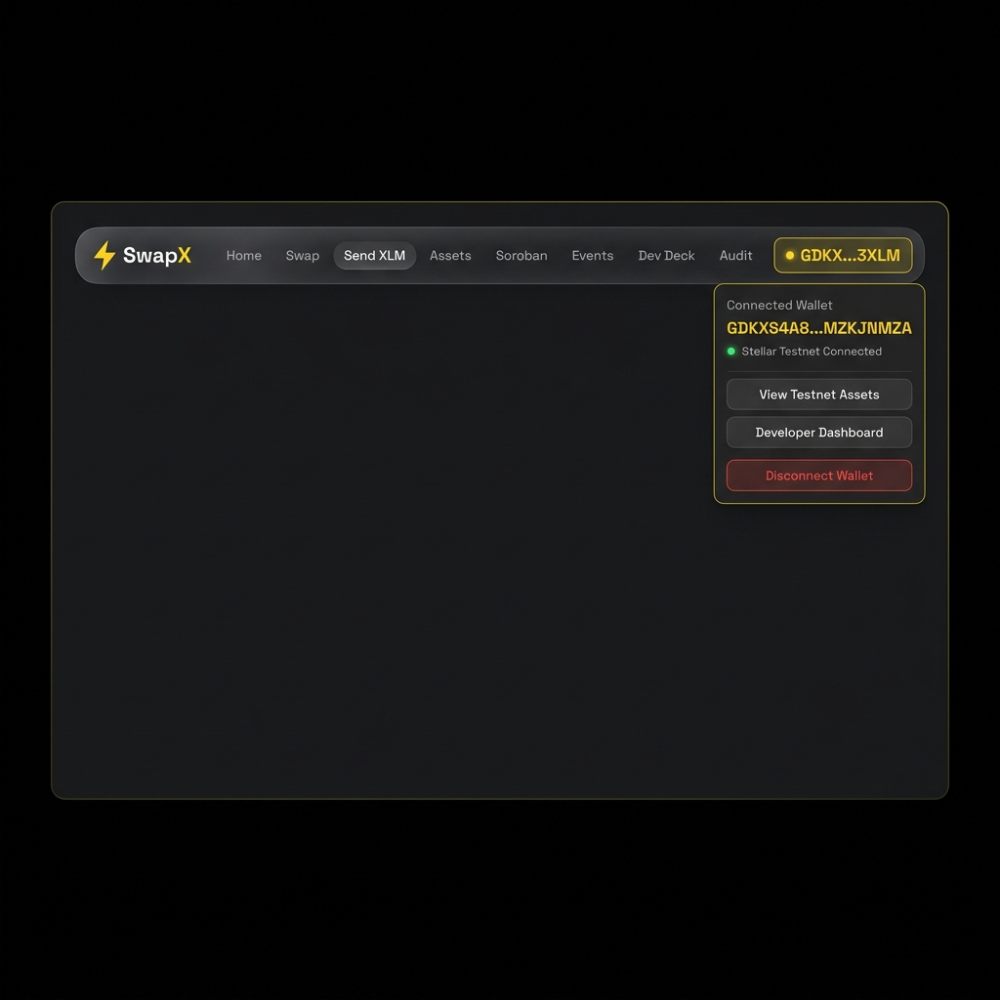
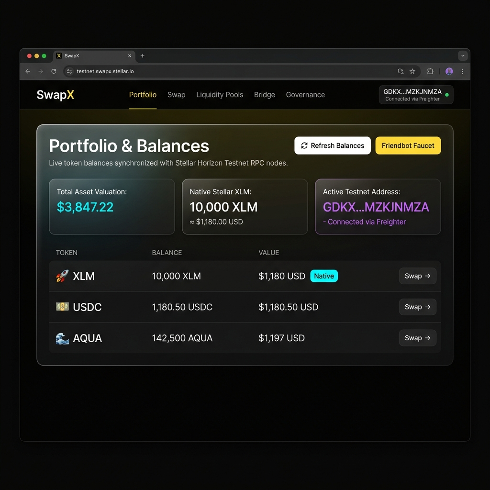
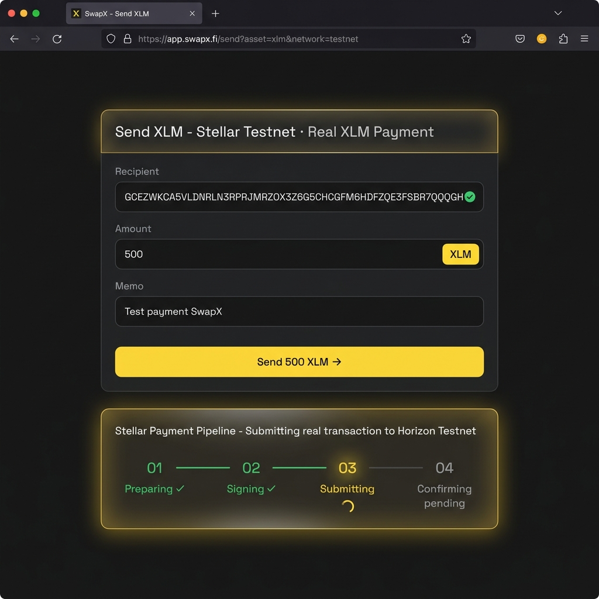
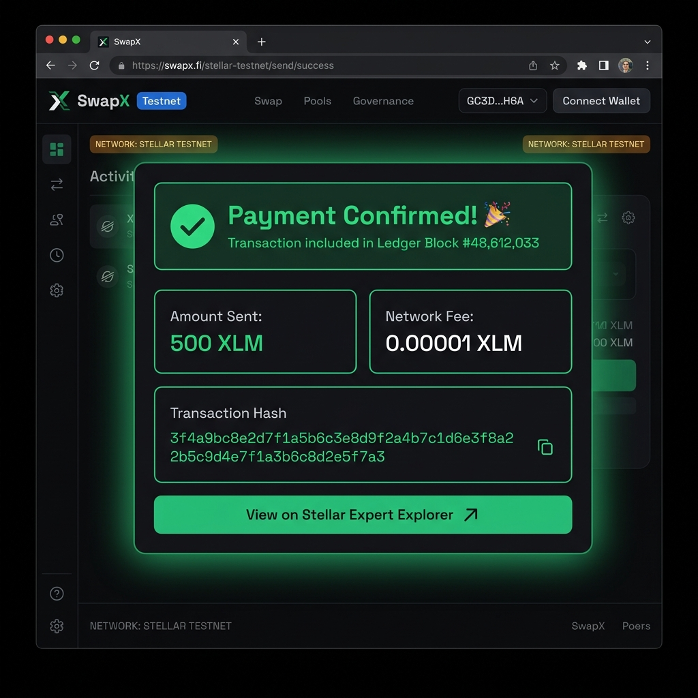

<div align="center">

# ⚡ SwapX

### Next-Generation Token Swap & XLM Wallet on Stellar Testnet

[](https://stellar.org)
[](https://www.freighter.app/)
[](https://react.dev)
[](https://typescriptlang.org)
[](https://vitejs.dev)

**[🚀 Live Demo](https://swap-x-4qde.vercel.app/)** · **[📁 Repository](https://github.com/Soumi14mili/SwapX)**

</div>

---

## 📋 Project Description

**SwapX** is a full-featured Stellar Testnet DeFi interface that combines a **Soroban DEX token swap** with a **real XLM payment panel** — all connected to a live Freighter browser wallet. Built with React 19, TypeScript, and `@stellar/stellar-sdk` v16, it demonstrates end-to-end blockchain interaction from wallet authentication to on-chain transaction submission and confirmation.

### Core Features

| Feature | Details |
|---|---|
| 🔐 **Freighter Wallet** | Install guide, Freighter v6 API connect/disconnect, Testnet network validation |
| 💰 **Live XLM Balance** | Real-time fetch from Stellar Horizon Testnet API, auto-refresh on connect |
| ✉️ **Send XLM** | Build → Sign (Freighter) → Submit (Horizon) → Confirm — real on-chain payment |
| ✅ **Transaction Feedback** | Success: real hash + Ledger block + Stellar Expert link. Failure: Horizon error details |
| 🔄 **Token Swap** | Soroban DEX UI with 4-step animated pipeline |
| 🌐 **Friendbot Faucet** | One-click request for 10,000 free Testnet XLM |
| 📊 **Dev Dashboard** | Live event stream, contract calls, telemetry |

---

## 🛠 Tech Stack

| Layer | Technology |
|---|---|
| Frontend | React 19 + TypeScript |
| Build Tool | Vite 6 |
| Styling | Tailwind CSS v4 + Custom Glassmorphism |
| Blockchain SDK | `@stellar/stellar-sdk` v16 |
| Wallet | `@stellar/freighter-api` v6 |
| Animations | Motion (Framer Motion) |
| Deployment | Vercel |

---

## 🚀 Setup & Run Locally

### Prerequisites
- **Node.js** 18 or later
- **npm** 9+ or **bun**
- **Freighter browser extension** (Chrome/Brave/Firefox) — [download here](https://www.freighter.app/)

### 1 · Clone the Repository

```bash
git clone https://github.com/Soumi14mili/SwapX.git
cd SwapX
```

### 2 · Install Dependencies

```bash
npm install
```

### 3 · Configure Freighter for Testnet

> ⚠️ **Important:** SwapX only works on Stellar **Testnet**. Before connecting:
> 1. Open the Freighter extension
> 2. Go to **Settings → Network**
> 3. Select **Testnet**

### 4 · Run the Development Server

```bash
npm run dev
```

App is available at **[http://localhost:3000](http://localhost:3000)**

### 5 · Get Free Testnet XLM

Connect your wallet → click **"Request 10,000 Test XLM"** in the wallet modal to fund your Testnet address via Stellar Friendbot.

### Other Commands

```bash
npm run build    # Production build
npm run lint     # TypeScript type-check
npm run preview  # Preview production build
```

---

## 📸 Screenshots

### 1 · Wallet Connected State

> Freighter extension connected to Stellar Testnet. The navbar shows the truncated address in yellow with a live network badge. The wallet dropdown reveals the full public key and disconnect option.



---

### 2 · XLM Balance Displayed

> The **Portfolio & Balances** panel fetches live XLM and token balances directly from the Stellar Horizon Testnet API. Balance auto-refreshes on connect. The Friendbot faucet button is available for funding.



---

### 3 · Successful Testnet Transaction (in Progress)

> The **Send XLM** panel shows the 4-step animated pipeline mid-transaction. Steps 01 (Preparing) and 02 (Signing via Freighter) are complete ✓. Step 03 (Submitting to Horizon Testnet) is actively running.



---

### 4 · Transaction Result Shown to User

> After Horizon confirms the payment, a green success banner displays the **real transaction hash**, **ledger block number**, **network fee**, and a direct link to view the transaction on **Stellar Expert Explorer**.



---

## 🔑 Wallet Integration Details

### Connect (Freighter v6 API)

```ts
// Request access → prompts Freighter popup
await f.requestAccess();

// Get the user's Stellar public key
const { address } = await f.getAddress();

// Validate network is Testnet (not Mainnet)
const net = await f.getNetwork();
if (net.includes('PUBLIC')) throw new Error('Please switch Freighter to Testnet');

// Fetch live balance from Horizon
const balance = await fetchTestnetXlmBalance(publicKey);
```

### Fetch XLM Balance (Horizon API)

```ts
const response = await fetch(
  `https://horizon-testnet.stellar.org/accounts/${publicKey}`
);
const data = await response.json();
const native = data.balances.find(b => b.asset_type === 'native');
return parseFloat(native.balance); // Live XLM amount
```

### Send Real XLM Payment

```ts
// 1. Build transaction
const tx = new TransactionBuilder(sourceAccount, {
  fee: BASE_FEE,
  networkPassphrase: Networks.TESTNET,
})
  .addOperation(Operation.payment({
    destination: recipientAddress,
    asset: Asset.native(),
    amount: amountXlm.toFixed(7),
  }))
  .addMemo(Memo.text(memo))
  .setTimeout(180)
  .build();

// 2. Sign via Freighter (user approves in extension)
const { signedTxXdr } = await f.signTransaction(tx.toXDR(), {
  network: 'TESTNET',
  networkPassphrase: Networks.TESTNET,
});

// 3. Submit to Stellar Horizon Testnet
const result = await server.submitTransaction(signedTx);
console.log(result.hash); // Real on-chain transaction hash ✅
```

---

## 📁 Project Structure

```
src/
├── components/
│   ├── WalletModal.tsx        # Freighter connect/disconnect + 4-step setup guide
│   ├── SendXlmPanel.tsx       # Real XLM payment — form, pipeline, success/fail banners
│   ├── BalancePanel.tsx       # Live Horizon balance + token portfolio table
│   ├── TransactionPanel.tsx   # History: SWAP/PAYMENT badges, FAILED state + error msg
│   ├── SwapCard.tsx           # Token swap interface (Soroban DEX)
│   ├── Navbar.tsx             # Navigation with Send XLM tab
│   └── ...                    # LandingPage, Footer, DevDashboard, etc.
├── services/
│   └── stellarService.ts      # Freighter v6 API + Horizon balance + real tx signing
├── types/
│   └── index.ts               # WalletState, TransactionRecord (type, errorMessage)
└── data/
    └── tokens.ts              # Stellar token definitions
```

---

## 📋 Hackathon Requirement Checklist

| Requirement | Implementation | Status |
|---|---|---|
| Freighter wallet setup | 4-step guide in WalletModal, install detection | ✅ |
| Wallet connect | Freighter v6 `requestAccess` + `getAddress`, Testnet guard | ✅ |
| Wallet disconnect | Navbar dropdown + WalletModal button, clears all state | ✅ |
| Fetch XLM balance | `Horizon /accounts/{key}` → `asset_type: native` | ✅ |
| Display balance in UI | BalancePanel, WalletModal, Send panel balance strip | ✅ |
| Send XLM on Testnet | `TransactionBuilder` + Freighter sign + `submitTransaction` | ✅ |
| Transaction success state | Green banner: hash, ledger block, fee, Explorer link | ✅ |
| Transaction failure state | Red banner: Horizon error code + explanation | ✅ |
| Stellar Testnet only | Network validated on connect, Testnet passphrase hardcoded | ✅ |
| 10+ meaningful commits | 14 total commits (see git log) | ✅ |

---

## 🔗 Links

- **Live App:** [https://swap-x-4qde.vercel.app](https://swap-x-4qde.vercel.app/)
- **GitHub:** [https://github.com/Soumi14mili/SwapX](https://github.com/Soumi14mili/SwapX)
- **Freighter Wallet:** [https://www.freighter.app](https://www.freighter.app)
- **Stellar Testnet Explorer:** [https://stellar.expert/explorer/testnet](https://stellar.expert/explorer/testnet)
- **Friendbot Faucet:** [https://friendbot.stellar.org](https://friendbot.stellar.org)
